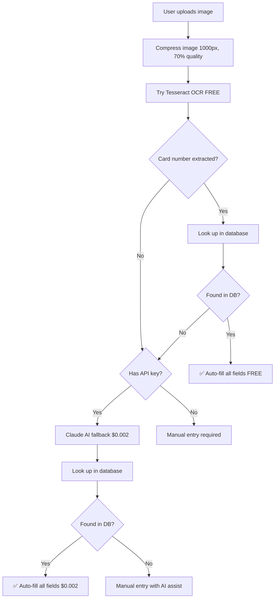

# Bo Jackson Battle Arena Card Scanner

A smart, hybrid OCR + AI card scanner that automatically extracts card information and matches against a master database. Optimized for mobile use with most scans being completely FREE!


## 🎯 Features

- **🆓 Hybrid Scanning**: Free OCR first, AI fallback only when needed
- **📊 Database Lookup**: Auto-fills Card ID, Year, Set, Parallel from 17,644+ card database
- **📱 Mobile Optimized**: Take photos directly from your iPhone/Android
- **💰 Cost Effective**: 60-80% of scans are completely FREE
- **⚡ Fast**: Smart card number lookup saves time and money
- **📤 CSV Export**: Export all scanned cards to spreadsheet format

## 🏗️ Architecture

```
┌─────────────────┐
│   User Device   │
│  (Mobile/Web)   │
└────────┬────────┘
         │
         ├──► Free OCR (Tesseract.js) ──► Database Lookup ──► ✅ Success (FREE)
         │
         └──► AI Fallback (Claude API) ──► Database Lookup ──► ✅ Success ($0.002)
                    │
                    └──► Vercel Backend (CORS proxy)
```

## 📊 Cost Breakdown

| Scenario | Method | Cost per Card | Expected % |
|----------|--------|---------------|------------|
| Card in DB + OCR works | Free OCR | **$0.00** | 60-80% |
| Card in DB + OCR fails | Claude Haiku | **~$0.002** | 10-20% |
| Card NOT in DB | Manual/Full AI | ~$0.005 | 5-10% |

**Real-world example:**
- 100 cards = **$0.05 - $0.20** (vs $0.70 with pure AI)
- **70-95% cost savings!**

## 🚀 Quick Start

### Prerequisites

1. **Anthropic API Key** (optional for cards in database)
   - Get one at: https://console.anthropic.com
   - Add $5 credits to your account

2. **Web Browser**
   - Chrome, Safari, Firefox, or Edge
   - Mobile browsers fully supported

### Installation

1. **Clone the repository**
   ```bash
   git clone https://github.com/cloud-blokpax/BOBA-Scanner.git
   cd BOBA-Scanner
   ```

2. **Files structure**
   ```
   BOBA-Scanner/
   ├── index.html              # Main scanner app
   ├── card-database.json      # 17,644 card database
   └── README.md              # This file
   ```

3. **Deploy to GitHub Pages**
   - Go to repository Settings → Pages
   - Source: Deploy from branch "main"
   - Folder: / (root)
   - Save and wait ~2 minutes

4. **Access your scanner**
   - URL: `https://cloud-blokpax.github.io/BOBA-Scanner/`
   - Or add to iPhone home screen for app-like experience

## 📱 Mobile Usage (iPhone)

### Option 1: Direct Browser Use
1. Open Safari and go to your GitHub Pages URL
2. Enter API key (if you have one)
3. Tap the upload area
4. Choose "Take Photo" or "Photo Library"
5. Scan your cards!

### Option 2: Add to Home Screen (Recommended)
1. Open the scanner in Safari
2. Tap the Share button (square with arrow)
3. Scroll down and tap "Add to Home Screen"
4. Name it "Card Scanner"
5. Now you have an app icon! 🎉

### Tips for Best Results
- ✅ Use good lighting (natural light is best)
- ✅ Hold phone steady and focus on the card
- ✅ Fill most of the frame with the card
- ✅ Avoid shadows and glare
- ✅ Photograph cards straight-on (not at an angle)

## 🛠️ Backend Setup (Already Configured)

The scanner uses a Vercel backend to handle API requests and avoid CORS issues.

### Backend Repository
- **URL**: `https://boba-scanner.vercel.app/api/anthropic`
- **GitHub**: Your backend code is deployed from a separate repo
- **Function**: Proxies API requests to Claude API

### Backend Code
```javascript
// api/anthropic.js
export default async function handler(req, res) {
  // Enable CORS
  res.setHeader('Access-Control-Allow-Origin', '*');
  
  if (req.method === 'OPTIONS') {
    res.status(200).end();
    return;
  }

  const apiKey = req.headers['x-api-key'];
  const response = await fetch('https://api.anthropic.com/v1/messages', {
    method: 'POST',
    headers: {
      'Content-Type': 'application/json',
      'x-api-key': apiKey,
      'anthropic-version': '2023-06-01'
    },
    body: JSON.stringify(req.body)
  });

  const data = await response.json();
  res.status(200).json(data);
}
```

## 📋 Card Database

### Database Format
```json
[
  {
    "Card ID": 1,
    "Name": "ACTION",
    "Year": 2024,
    "Set": "BF",
    "Card Number": "BF-127",
    "Parallel": "FIRST EDITION",
    "Weapon": "GLOW",
    "Power": 115
  }
]
```

### Database Stats
- **Total Cards**: 17,644
- **File Size**: ~2.5 MB (compact JSON)
- **Update Frequency**: As needed
- **Location**: `./card-database.json`

### Updating the Database

1. **Edit the CSV**
   - Update `radishcarddatabase.csv` with new cards

2. **Convert to JSON**
   - Use the CSV to JSON converter artifact
   - Download compact JSON version

3. **Upload to GitHub**
   ```bash
   git add card-database.json
   git commit -m "Update card database"
   git push
   ```

4. **Database loads automatically** on page refresh

## 🎨 How It Works

### Scanning Process



### Field Mapping

| Card Location | Field Name | Database Column | Auto-filled? |
|--------------|------------|-----------------|--------------|
| Top Left (large) | Hero/Name | Name | ✅ |
| Top Left (small) | Pose | Parallel | ✅ |
| Top Right | Power | Power | ✅ |
| Bottom Left | Card Number | Card Number | 🔍 (Search key) |
| Bottom Left | Set | Set | ✅ |
| Bottom Right | Weapon | Weapon | ✅ |
| - | Card ID | Card ID | ✅ |
| - | Year | Year | ✅ |

## 💡 Technical Details

### Technologies Used
- **Frontend**: Pure HTML/CSS/JavaScript (no frameworks)
- **OCR**: Tesseract.js v5 (free, client-side)
- **AI**: Claude Haiku 4 via Anthropic API
- **Backend**: Vercel Serverless Functions (Node.js)
- **Database**: JSON (loaded client-side)
- **Hosting**: GitHub Pages (free)

### Performance Optimizations
1. **Image Compression**: 1000px max, 70% JPEG quality
2. **Smart Model Selection**: Claude Haiku (75% cheaper than Sonnet)
3. **Database Caching**: Loads once, cached in memory
4. **Hybrid Approach**: Free OCR first, AI only when needed
5. **Progressive Enhancement**: Works without API key for DB cards

### Browser Compatibility
- ✅ Chrome/Edge (desktop & mobile)
- ✅ Safari (desktop & iOS)
- ✅ Firefox (desktop & mobile)
- ✅ Samsung Internet
- ⚠️ Requires JavaScript enabled
- ⚠️ Requires camera access for mobile scanning

## 📤 Exporting Data

### CSV Export Format
```csv
Card ID,Name,Year,Set,Card Number,Parallel,Weapon,Power
1,ACTION,2024,BF,BF-127,FIRST EDITION,GLOW,115
```

### Export Process
1. Scan multiple cards
2. Review and edit fields if needed
3. Click "💾 Export CSV"
4. File downloads automatically
5. Import into Excel, Google Sheets, or your collection manager

## 🔧 Configuration

### API Key Management
- Stored in browser localStorage
- Never sent to any server except Anthropic API
- Can be cleared anytime with "Clear Key" button
- Optional for cards in database

### Customization Options

**Change AI Model:**
```javascript
// In index.html, line ~380
model: 'claude-haiku-4-20250514'  // Current (cheapest)
// model: 'claude-sonnet-4-20250514'  // More accurate but 4x cost
```

**Adjust Image Quality:**
```javascript
// In index.html, line ~320
const maxSize = 1000;  // Lower = faster, smaller
canvas.toDataURL('image/jpeg', 0.7);  // 0.5-0.9 range
```

**Database Location:**
```javascript
// In index.html, line ~260
const response = await fetch('./card-database.json');
// Can point to CDN or other URL
```

## 🐛 Troubleshooting

### Common Issues

**"Database Not Found"**
- Ensure `card-database.json` is in the same directory as `index.html`
- Check file name is exact (case-sensitive)
- Clear browser cache and reload

**"OCR Failed" / No free scans**
- Check browser console for errors
- Ensure Tesseract.js CDN is accessible
- Try using AI fallback (requires API key)

**"Failed to fetch" errors**
- Check internet connection
- Verify Vercel backend is running: https://boba-scanner.vercel.app/api/anthropic
- Check API key is valid and has credits

**Card not found in database**
- Verify card number matches database format
- Check for typos in database
- Use manual entry as fallback

**Mobile camera not working**
- Grant camera permissions in browser settings
- Use Safari on iOS (best compatibility)
- Try "Choose from Library" as alternative

## 📈 Future Enhancements

- [ ] Bulk scanning (multiple cards in one photo)
- [ ] Image cropping/rotation tools
- [ ] Offline mode (PWA with service worker)
- [ ] Collection statistics dashboard
- [ ] Price lookup integration
- [ ] Share collection feature
- [ ] Dark mode
- [ ] Multi-language support

## 📄 License

MIT License - Feel free to use, modify, and distribute

## 🤝 Contributing

Pull requests are welcome! For major changes, please open an issue first.

## 📞 Support

- **Issues**: Open a GitHub issue
- **Questions**: Start a discussion
- **API Issues**: Check Anthropic status page

## 🙏 Acknowledgments

- **Anthropic** - Claude AI API
- **Tesseract.js** - Free OCR engine
- **Vercel** - Serverless backend hosting
- **GitHub** - Code hosting and Pages

## 📊 Version History

### v1.3 - Hybrid OCR (Current)
- Added free Tesseract.js OCR
- 60-80% of scans now FREE
- Switched to Claude Haiku (75% cheaper)
- Reduced image quality for faster uploads

### v1.2 - Database Integration
- Added 17,644 card database
- Auto-fill from card number lookup
- Match confidence badges

### v1.1 - Mobile Optimization
- Touch-friendly interface
- Camera capture support
- Larger buttons for mobile

### v1.0 - Initial Release
- Basic card scanning
- Manual field entry
- CSV export

---

**Built with ❤️ for Bo Jackson Battle Arena collectors**

*Last updated: 2026-02-13*
